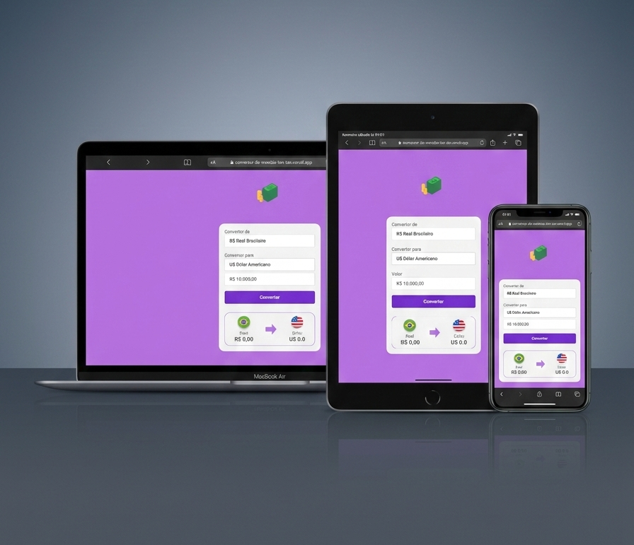

# 👩‍💻 Mariana Azevedo 

**`Desenvolvedora Front-End `**

  :sparkles: Olá! Seja bem-vindo(a) ao meu GitHub. Sou Mariana, Desenvolvedora Front-End, apaixonada por transformar ideias em interfaces funcionais, modernas e bem construídas.

 Atualmente estou iniciando meus estudos em React, com o objetivo de evoluir na minha trajetória profissional e desenvolver aplicações web cada vez mais completas. Estou sempre em busca de aprendizado, novos desafios e oportunidades para crescer como desenvolvedora.

# 💻 Tecnologias

       

# :rocket: Projetos em destaque

<h2> :iphone: Site Iphone </h2>

Landing page inspirada no site oficial do iPhone, criada para praticar desenvolvimento Front-End, explorando design moderno, responsividade e organização de interface.

<h3>Tecnologias</h3>

 

<h3>Preview do Projeto</h3>
 

🔗 [Ver Projeto](https://site-iphone-chi.vercel.app/)
          

<h2> :currency_exchange: Conversor de Moedas</h2>

Aplicação web que permite converter valores entre diferentes moedas de forma rápida e prática.

<h3>Tecnologias</h3>

  

<h3>Preview do Projeto</h3>
 

🔗 [Ver Projeto](https://conversor-de-moedas-pearl.vercel.app/)

# :mailbox: Conecte-se comigo

 

          
          
          
        
          
          
          

          
          

---

<!-- Proudly created with GPRM ( https://gprm.itsvg.in ) -->
